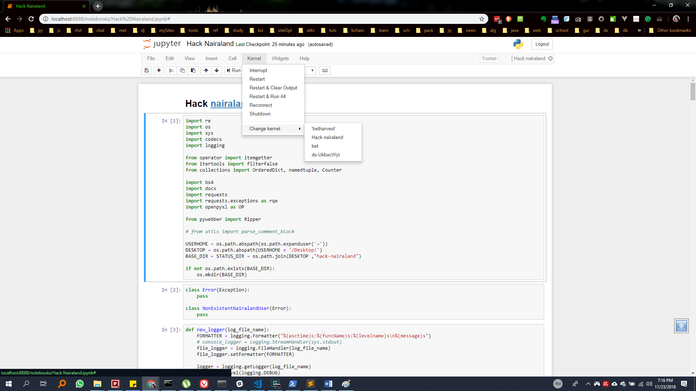

# Hack [Nairaland](https://nairaland.com) - an exercise on web scraping.

## What you can do with this notebook

1. Export all comments ever made by a user to an excel file (other formats may be added).
1. Export all post titles from a section within a range that you specify to an excel file (other formats may be added).
1. Get all unique commenters on a post
1. Get all commenters on a post and their comment frequency
1. Save a post permanently by exporting it to word
1. Pick two users and see their discussion thread (to do)

## How to work with this notebook

1. Download or clone the `bitbucket` folder
1. Open `cmd.exe` and `cd` (i.e. navigate) into the downloaded folder
1. Issue the command `pipenv install`. This step requires that you have `python` and `pipenv` installed in your system

## Creating the environment on your own

1. To complete this step you have to delete both `Pipfile` and `Pipfile.lock`

1. Download or clone the `bitbucket` folder
1. Open `cmd.exe` and `cd` (i.e. navigate) into the downloaded folder
1. Issue the command `pipenv install`. This step requires that you have `python` and `pipenv` installed in your system
1. Open `cmd.exe` and `cd` (i.e. navigate) into the folder
1. Issue commands `pipenv install`. Wait for the environment to be created.
1. When environment creation is done, activate it by issuing the command `pipenv shell`
1. After environment activation, issue commands `pipenv install jupyter`, `pipenv install ipykernel`
1. To create the custom `ipython` kernel, issue command

    `python -m ipykernel install --user --name other-env --display-name "Hack nairaland"`

    `python -m ipykernel install --user --display-name "Hack nairaland or whatever name you like"`

1. The `--user other-env` argument, value pair is optional. See [here](https://ipython.readthedocs.io/en/stable/install/kernel_install.html#kernels-for-different-environments) for explanation
1. Now when you reload your `ipython/jupyter` notebooks you should see the newly created kernel listed under kernels. You can see mine in the screenshot below.



## Data Structures

Every function has its own data structure. They are documented here for easy understanding of the program logic.

### `parse_comment_block`

Returns a [namedtuple](https://docs.python.org/3.6/library/collections.html#namedtuple-factory-function-for-tuples-with-named-fields)

```python
namedtuple('ParsedComment', ['focus_user_comment', 'quotes_ordered_dictionary'])

# Internal structure
('focus_user_comment', OrderedDict([('moniker', 'comment')]))
```

### `PostCollector()`

This class is used to scrap a nairaland post.

`PostCollector.scrap_comments_for_page_range()`

Return type of `types.generator`. `Yield`s `OrderedDict()` objects. Where each has structure shown below.

```python
OrderedDict(['moniker', parse_comment_block function object])
```

### User `comment header` `<tr>` structure - Post view

```html
<tr>
    <td class="bold l pu">
        <a name="68136427"></a>
        <a name="msg68136427"></a>
        <a name="4539839.6"></a>
        <a href="/4539839/agu-aina-dropped-nigerias-final#68136427">Re:Topic.</a>
        by
        <a href="/moniker" class="user" title="Location: Detroit">moniker</a>
        (
        <span class="m or f">m or f</span>
        ):
        <span class="s">
            <b>00:00am</b>
        </span>
    </td>
</tr>
```

### User `comment text` `<tr>` structure - Post view

```html
<tr>
    <td id="pb68136427" class="l w pd">
        <div class="narrow">
            <blockquote>
                <a href="/post/68136377">
                    <b>moniker</b>
                </a>
                :
                <br>
                comment
            </blockquote>
            <br>
            <br>
            comment
        </div>
        <p class="s">
            <b id="lpt68136427">n Likes </b>
            <b id="shb68136427">n Share</b>
        </p>
    </td>
</tr>
```

## `UserCommentHistory()`

### User `comment header` `<tr>` structure - Comment history view

```html
<tr>
    <td class="bold l pu">
        <a name=""></a>
        <a name=""></a>
        <a name=""></a>
        
        <a href="/section-url">Section name</a>
        /
        <a href="/0000/title">Re: Post title</a>
        by
        <a href="/username" class="user" title="Location:location">username</a>
        (
        <span class="m or f">m or f</span>
        ):
        <span class="s">
            <b>00:00pm</b>
            On
            <b>Oct 19</b>
            ,
            <b>2017</b>
        </span>
    </td>
</tr>
```

### User comments text `<tr>` structure - Comment history view

This section has a few other elements if you're logged in

```html

<tr>
    <td id="" class="l w pd">
        <div class="narrow">
            <blockquote> <!-- each blockquote represents a quoted comment -->
                <a href="/post/00000000">
                    <b>Moniker</b>
                </a>
                :
                <br> <!-- there'll be as many of these as the number of enter keys a user presses-->
                Some comment
                
            </blockquote>
            some comment
        </div>
        <p class="s">
            <b id="lpt61581477">n Likes </b>
            <b id="shb61581477">n Share</b>
        </p>
    </td>
</tr>
```

## A supposed anomaly I found in the table

It contains nothing. Just a blank row.

```html
<tr>
    <td class="l pu pd">
        <a name="68130046"></a>
    </td>
</tr>
```

### Unpacking user comments history

```python
import textwrap

user = UserCommentHistory("preccy69")
for page in list(user.scrap_comments_for_page_range(start=0, stop=1)):
    for section, topic_plus_comment in page.items():
        print("\n\n", "*"*40, section, "*"*40)
        print(topic_plus_comment.topic.upper()) # for differentiation only

        parsed_comment = topic_plus_comment.parsed_comment # a namedtuple instance
        print(parsed_comment.focus_user_comment)

        quotes = parsed_comment.quotes_ordered_dict
        for username, comment in quotes.items():
            print(" "*8)
            print(textwrap.indent(username, "    "))
            print(textwrap.indent(comment, "    "))
        print("_"*100)
    print("\n\n")
```

## TopicCollector()

### Section topics `<tr>` structure

```html
<tr>
    <td id="top2792995" class="w">
        <a name="2792995"></a>
        
        <b>
            <a href="/2792995/nairaland-says-no-secessionists">Nairaland Says No To Secessionists</a>
        </b>
        <a href="topic-full-url/1">(1)</a>
        <a href="topic-full-url/2">(2)</a>
        <a href="topic-full-url/max-page">(max-page)</a>
        
        <b>*</b>
        <br>
        <span class="s">
            by
            <b>
                <a href="/username">username</a>
            </b>
            .
            <b>number of comments</b>
            posts &amp;
            <b>number of views</b>
            views.
            <b>00:00am</b>
            On
            <b>Jun 03</b> <!-- Visible for posts older than current date -->
            <b>2015</b> <!-- Visible for posts older than current year -->
            (
            <b>
                <a href="/donchris921">Donchris921</a>
            </b>
            )
        </span>
    </td>
</tr>
```

### Unpacking Topics

```python
import textwrap
p = TopicCollector(section='politics')
for page in p.scrap_topics_for_range_of_pages(end=1):
    for topic in list(page):
        print(topic.poster)
        print(textwrap.indent(topic.title, "    "))
        print(textwrap.indent(topic.url, "    "))
        print(textwrap.indent(str(topic.comments), "    "), " comments")
        print()
```
