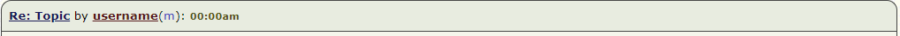
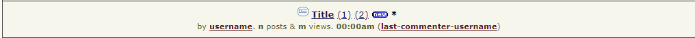

# Hack [Nairaland](https://nairaland.com)

This project started as an exercise on web scraping as a way to understand how `HTML` pages worked. Please do not use it to overload the nairaland servers. You could always pull in your data in chunks as I've demonstrated in the `politics-analysis` jupyter notebook. I'd advise you get your data at around midnight (Nigerian time), when there's likely to be less traffic.

I have documented some of the most common structures you'll find on the site. I decided to update it and release it publicly as part of my [portfolio](http://parousia.pythonanywhere.com/portfolio/).

## Challenges

1. The major challenge I encountered was how to scrap posts. Its quite hard to get a scrap that exactly matches original text as seen on nairaland. This is a result of multitude of `<br>` elements on the post and comment pages. Every press of the `ENTER` key adds a new `br` element and it makes it hard to actually grab the text contained therein. But thanks to `BeautifulSoup4` and the `html5lib` parser, up to 90% accuracy of representation was achieved.
1. Purposeful tradeoffs have been made in some cases, for example, in the case where a user quotes several others in one comment block, the `parse_comment_block` function ignores order when parsing the comments. It simply collects all of the user's comments into one block on top, then, all of the quoted user's comments into another block at the bottom. Which means that the ordering as you would see such a comment on nairaland is lost. But I made that decision because, from my experience using nairaland, such cases are not common.

## Acquiring and working with this project

1. Requirement: `python` and `pipenv` must be installed on your computer. You can download and install python from the [official site](https://www.python.org/downloads/). After installing python, you can install `pipenv` by issuing the command `pip install pipenv` inside `cmd.exe`.
1. Clone (aka grab your copy) the `github` repo with this link `git clone https://github.com/chidimo/hack-nairaland.git`.
1. Open `cmd.exe` and `cd` (i.e. navigate) into the downloaded `hack-nairaland` folder
1. Issue the command `pipenv install`. Wait for the environment to be recreated.
1. Issue the command `pipenv shell` to activate the environment.
1. The next step is to create the `ipython` kernel used by this project. My own is shown in the image below for reference.

## Creating the `hack-nairaland` kernel

To create the custom `ipython` kernel, issue the following commands (This step is required)

1. `python -m ipykernel install --user --name other-env --display-name "Hack nairaland"`

1. `python -m ipykernel install --user --display-name "Hack nairaland or whatever name you like"`

See this [gist](https://gist.github.com/chidimo/fa24e4172649e99eb1912c921117c7f6) for more details.


## Functionalities

Several demos of this project in action are provided in the accompanying `Hack Nairaland` `jupyter notebook`. You should start from there.

1. Export all comments made by a user to html or excel file. You may select how many pages of comments you want to grab.
1. Export all post titles from a section within a range that you specify to html or excel.
1. Get s of all unique commenters on a post
1. Get all commenters on a post and their comment frequency
1. Save a post permanently by exporting it to `docx` format
1. There's also an attempt at analyzing post titles using `pandas`. This analysis can be found in the accompanying `politics-analysis` `jupyter notebook`. You may use that as a template for your own analysis. The excel files I used in my analysis are available in the `politics-analysis/` folder, just in case you want to use those same files. The analysis covers only about `1,000` pages. As of the time of writing, the site reports that there over `8,000` pages of titles on the politics section. Each of these `1,000` pages have a minimum of `60` titles each, thus we're looking at over `60,000` titles. This is the reason I split the title collection into chunks of `100` pages each so that each excel file has about `6,000` rows of data. You could certainly go higher if you have good internet and hardware (aka RAM).

## Nairaland sections

Each of the classes `PostCollector`, ``, and `` have a `.sections` property that is inherited from the base `Nairaland` class. This property returns a python `dictionary` of `{section : section url}`. The complete output is shown below.


```python
{'Nairaland / General': '/nairaland',
 'Politics': '/politics',
 'Crime': '/crime',
 'Romance': '/romance',
 'Jobs/Vacancies': '/jobs',
 'Career': '/career',
 'Business': '/business',
 'Investment': '/investment',
 'NYSC': '/nysc',
 'Education': '/education',
 'Autos': '/autos',
 'Car Talk': '/cartalk',
 'Properties': '/properties',
 'Health': '/health',
 'Travel': '/travel',
 'Family': '/family',
 'Culture': '/culture',
 'Religion': '/religion',
 'Food': '/food',
 'Diaries': '/diaries',
 'Nairaland Ads': '/ads',
 'Pets': '/pets',
 'Agriculture': '/agriculture',
 'Entertainment': '/entertainment',
 'Jokes Etc': '/jokes',
 'TV/Movies': '/tv-movies',
 'Music/Radio': '/music-radio',
 'Celebrities': '/celebs',
 'Fashion': '/fashion',
 'Events': '/events',
 'Sports': '/sports',
 'Gaming': '/gaming',
 'Forum Games': '/forum-games',
 'Literature': '/literature',
 'Science/Technology': '/science',
 'Programming': '/programming',
 'Webmasters': '/webmasters',
 'Computers': '/computers',
 'Phones': '/phones',
 'Art, Graphics & Video': '/graphics-video',
 'Technology Market': '/techmarket'}
```

## Data Structures

The return value of every function has its own data structure. They are documented here for better understanding of the program logic.

### Functions

#### `def get_left_right_of_html_br_element(br_element)`

This function checks a single html `<br>` element and determines if it has texts before and/or after it, then it returns those texts as a `list` of `[content before <br> element, content after <br> element]`

#### `def join_tuples(list_of_tuples)`

Joins a list of `(2-tuples)` into a single string.

#### `format_comments(bs4_comment_block_object)`

Takes a block of `BeautifulSoup4` object comment and formats it into proper paragraphs.

This function has a side effect of writing all comments it encounters to a single file. This file can be found in `comment-blocks/` folder. It acts as a kind of log of every comment block that is encountered as you work with this project. View as raw html to see what the actual html blocks look like.

#### `def parse_comment_block(bs4_comment_block_object)`

```python
namedtuple('ParsedComment', ['focus_user_comment', 'quotes_ordered_dict'])

# Internal structure
('focus_user_comment', OrderedDict([('', 'comment')]))

('quotes_ordered_dict', OrderedDict([('', 'comment')]))
```

### Classes

#### `Nairaland()`

This is the base class for all other classes defined here.

#### `PostCollector()`

This class is employed in scraping a nairaland post.

`PostCollector.scrap_comments_for_range_of_post_pages()`

Return type of `types.generator`. It `yield`s `OrderedDict()`s, where each has the structure shown below.

```python
OrderedDict(['', parse_comment_block function object])
```

##### User comment header `<tr>` structure in *post view*



```html
<tr>
    <td class="bold l pu">
        <a name="68136427"></a>
        <a name="msg68136427"></a>
        <a name="4539839.6"></a>
        <a href="/4539839/agu-aina-dropped-nigerias-final#68136427">Re: Topic</a>
        by
        <a href="/" class="user" title="Location: Detroit">username</a>
        (
        <span class="m or f">m or f</span>
        ):
        <span class="s">
            <b>00:00am</b>
        </span>
    </td>
</tr>
```

##### User comment text `<tr>` structure in *post view*


```html
<tr>
    <td id="pb68136427" class="l w pd">
        <div class="narrow">
            <blockquote>
                <a href="/post/68136377">
                    <b> of quoted commenter</b>
                </a>
                :
                <br>
                Quoted comment text
            </blockquote>
            <br>
            <br>
            Owner comment text
        </div>
        <p class="s">
            <b id="lpt68136427">n Likes </b>
            <b id="shb68136427">m Share</b>
        </p>
    </td>
</tr>
```

##### Unpacking post

```python
import textwrap

post = hack.PostCollector('https://www.nairaland.com/4862847/presidency-well-teach-nursery-school')
print(post.get_title())
for page in list(post.scrap_comments_for_range_of_post_pages(start=0, stop=2)):
    for _username, parsed_comment in page.items():
        print(_username)
        print(parsed_comment.focus_user_comment)
        for commenter, comment in parsed_comment.quotes_ordered_dict.items():
            print(textwrap.indent(commenter, "    "))
            print(textwrap.indent(comment, "    "))
        print("\n", "*"*100, "\n")
    print("+"*40, " new page ", "+"*40)
```

<hr>

#### `UserCommentHistory()`

##### User comment header `<tr>` structure in *comment history* view


```html
<tr>
    <td class="bold l pu">
        <a name=""></a>
        <a name=""></a>
        <a name=""></a>
        
        <a href="/section-url">Section name</a> / <a href="/0000/title">Re: Post title</a>
        by
        <a href="/username" class="user" title="Location:location">username</a>
        (
        <span class="m or f">m or f</span>
        ):
        <span class="s">
            <b>00:00pm</b>
            On
            <b>Oct 19</b>
            ,
            <b>2017</b>
        </span>
    </td>
</tr>
```

##### User comments text `<tr>` structure in *comment history* view


This section has a few other elements displayed for a logged in user

```html

<tr>
    <td id="" class="l w pd">
        <div class="narrow">
            <blockquote> <!-- each blockquote represents a quoted comment -->
                <a href="/post/00000000">
                    <b> of quoted user</b>
                </a>
                :
                <br> <!-- there'll be as many of these as the number of enter keys a user presses-->
                Quoted user comment
                
            </blockquote>
            Owner comment text
        </div>
        <p class="s">
            <b id="lpt61581477">n Likes </b>
            <b id="shb61581477">n Share</b>
        </p>
    </td>
</tr>
```

##### A supposed anomaly I found in the table

It contains nothing. Just a blank row.

```html
<tr>
    <td class="l pu pd">
        <a name="68130046"></a>
    </td>
</tr>
```

##### Unpacking user comments history

```python
import textwrap

for page in list(UserCommentHistory("preccy69").scrap_comments_for_range_of_user_pages(start=0, stop=1)):
    for section, topic_plus_comment in page.items():
        print("\n\n", "*"*40, section, "*"*40)
        print(topic_plus_comment.topic.upper()) # for differentiation only

        parsed_comment = topic_plus_comment.parsed_comment # a namedtuple instance
        print(parsed_comment.focus_user_comment)

        quotes = parsed_comment.quotes_ordered_dict
        for username, comment in quotes.items():
            print(" "*8)
            print(textwrap.indent(username, "    "))
            print(textwrap.indent(comment, "    "))
        print("_"*100)
    print("\n\n")
```

<hr>

### TopicCollector()

##### Section topics `<tr>` structure



```html
<tr>
    <td id="top2792995" class="w">
        <a name="2792995"></a>
         <!--This is used as some kind of label-->
        <b>
            <a href="/2792995/some-text">Title</a>
        </b>
        <a href="topic-full-url/1">(1)</a>
        <a href="topic-full-url/2">(2)</a>
        <!--many other pages may be displayed is similar format
        <a href="topic-full-url/2">(2)</a>
        -->
        <a href="topic-full-url/max-page">(max-page)</a>
        
        <b>*</b>
        <br>
        <span class="s">
            by
            <b> <!--These <b> tags occur a maximum of 7 times-->
                <a href="/username">username</a>
            </b>
            .
            <b>n</b>
            posts &
            <b>m</b>
            views.
            (
            <b>
            <a href="/last-commenter-username">last-commenter-username</a>
            </b>
            )
            <b>00:00am</b>
            On
            <b>Jun 03</b> <!-- Visible for posts older than current date -->
            <b>2015</b> <!-- Visible for posts older than current year -->
            (
            <b>
                <a href="/username">username</a>
            </b>
            )
        </span>
    </td>
</tr>
```

### Unpacking Topics

```python
import textwrap

for page in TopicCollector(section='politics').scrap_topics_for_range_of_pages(start=0, stop=1):
    for topic in list(page):
        print(topic.poster)
        print(textwrap.indent(topic.title, "    "))
        print(textwrap.indent(topic.url, "    "))
        print(textwrap.indent(topic.comments, "    "), " comments")
        print(textwrap.indent(topic.views, "    "), " views")
        print(textwrap.indent(topic.last_commenter, "    "), " commented last")
        print(textwrap.indent(topic.other_meta, "    "))
        print()
```

### Output functions

#### `export_user_comments_to_html(username=None, max_page=5)`

#### `export_user_comments_to_excel(username=None, max_page=5)`

#### `export_topics_to_html(section='romance', start=0, stop=3)`

#### `export_topics_to_excel(section='romance', start=0, stop=3)`

## To do

1. Fix scroll to top link
1. Grab nairaland icons from page
